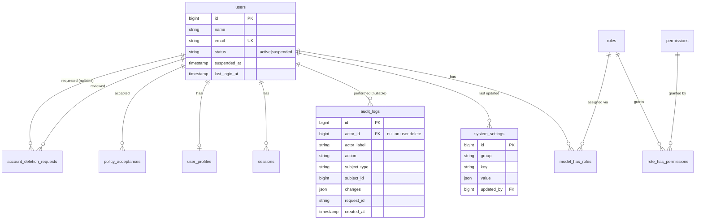

# Entity Relationship Diagram (end of Phase 2)

```mermaid
erDiagram
    users ||--o{ model_has_roles : "has"
    roles ||--o{ model_has_roles : "assigned via"
    roles ||--o{ role_has_permissions : "grants"
    permissions ||--o{ role_has_permissions : "granted by"
    users ||--o{ system_settings : "last updated"
    users ||--o{ audit_logs : "performed (nullable)"
    users ||--o{ sessions : "has"
    users ||--o| user_profiles : "has"
    users ||--o{ policy_acceptances : "accepted"
    users ||--o{ account_deletion_requests : "requested (nullable)"
    users ||--o{ account_deletion_requests : "reviewed"

    users {
        bigint id PK
        string name
        string email UK
        string status "active|suspended"
        timestamp suspended_at
        timestamp last_login_at
    }
    system_settings {
        bigint id PK
        string group
        string key
        json value
        bigint updated_by FK
    }
    audit_logs {
        bigint id PK
        bigint actor_id FK "null on user delete"
        string actor_label
        string action
        string subject_type
        bigint subject_id
        json changes
        string request_id
        timestamp created_at
    }
```

The diagram is extended at the end of each phase.
